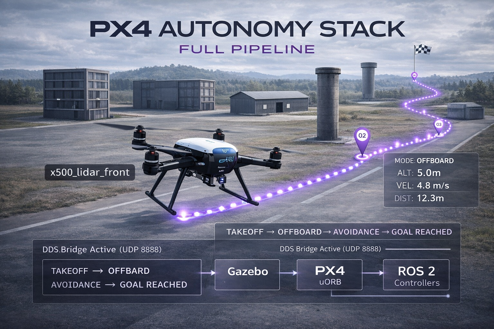

# PX4 Autonomous Waypoint Mission — MAVSDK Python



Autonomous multi-waypoint UAV mission using PX4 SITL, Gazebo Classic, and MAVSDK-Python.
The script generates a **lawnmower pattern** (3×3 grid = 9 waypoints), uploads it to a simulated Iris quadrotor,
executes the scan, returns to launch, and logs telemetry to a CSV file.

## Stack
- PX4 Autopilot 1.16 (SITL)
- Gazebo Classic 11
- MAVSDK-Python 3.15
- Ubuntu 22.04 / ROS 2 Humble

## What it does
1. Connects to PX4 via MAVLink over UDP
2. Clears any existing mission from the flight controller
3. Generates a lawnmower pattern (configurable rows × cols) and uploads it as a GPS mission
4. Arms and executes the mission autonomously
5. Triggers Return to Launch (RTL) on completion
6. Logs position telemetry to a timestamped CSV file
7. Exits cleanly on disarm

## Requirements
```bash
pip install mavsdk
```

## Usage

**Terminal 1 — Start PX4 SITL + Gazebo:**
```bash
cd ~/Desktop/PX4-Autopilot
rm -f build/px4_sitl_default/dataman
make px4_sitl gazebo-classic
```
Wait for `Ready for takeoff!`

**Terminal 2 — Start MAVSDK server:**
```bash
~/.local/lib/python3.10/site-packages/mavsdk/bin/mavsdk_server udpin://0.0.0.0:14540
```
Wait for `Server set to listen on 0.0.0.0:50051`

**Terminal 3 — Run the mission:**
```bash
python3 mission.py
```

## Output
```
Waiting for drone to connect...
Drone connected!
Waiting for global position...
Global position OK
Clearing any existing mission...
Generated 9 waypoints:
  WP1: lat=47.398 lon=8.5455
  ...
Uploading mission...
Arming...
Starting lawnmower scan...
  LOG | 15:14:01 | lat=47.3977508 lon=8.5456073 | alt=-0.01m
Mission progress: 0/9
...
Mission progress: 9/9
Scan complete!
Returning to launch...
Disarmed — mission complete.
Flight log saved to: flight_log_20260312_151359.csv
```

## Telemetry Log
Each flight generates a timestamped CSV:
```
time,latitude,longitude,alt_abs_m,alt_rel_m
15:14:01,47.3977508,8.5456073,488.13,-0.01
...
```

## Notes
- Lawnmower pattern: 3 rows × 3 cols, ~20 m step (adjust `step_lat`/`step_lon` in `mission.py`)
- Waypoint coordinates use the default PX4 SITL spawn location (Zurich)
- Simulated battery drains after each flight — full sim restart required between runs
- Delete `dataman` before each restart to clear stored mission state
- On real hardware: replace UDP connection with serial (`serial:///dev/ttyTHS1:921600`)

## Author
Abel — UAV autonomy stack development
GitHub: github.com/yourusername
