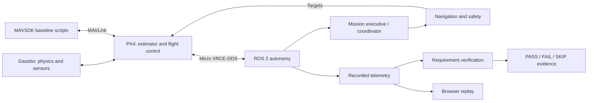

# PX4 / ROS 2 Autonomy & Verification Platform

Autonomous systems can say a task is complete even when the vehicle never actually completed it.

This project tests whether autonomous drones actually did what their software claims they did. It runs cooperative and single-UAV missions using ROS 2, PX4, Gazebo, MAVLink and MAVSDK, records the resulting flight telemetry, and independently checks whether the observed behavior satisfies explicit requirements — catching the cases where internal completion flags disagree with physical evidence.

**Built by Abel Mendoza.** PX4 stabilizes and controls the simulated aircraft. Abel implemented the ROS 2 mission logic, navigation and safety integration, sensor bridges, cooperative coordinator, telemetry pipeline, browser replay, and requirement-based verification around it.

### A bug the verifier caught

During cooperative recovery testing, one drone landed and the surviving drone inherited its unfinished work. The coordinator reported every task complete.

The recorded trajectory disagreed. The drone had turned away roughly 0.8–0.9 m from several task points — the coordinator declared those tasks complete before the vehicle had physically reached the required distance. Independent verification required an observed visit within 0.6 m, so the verifier rejected the mission.

The autonomy logic was fixed. The verifier was not weakened. Regression coverage now preserves the original faulty trace, and a fresh PX4/Gazebo recovery flight passed verification.

**[Watch the 3D telemetry replay ↗](https://replay-sepia-tau.vercel.app/demo/)** — recorded flight evidence, reconstructed in the browser. No ROS 2, PX4 or Gazebo installation required.

#### Bug caught by verification

| | |
| --- | --- |
| Coordinator status | `COMPLETE` |
| Observed closest approach | ~0.8–0.9 m ([preserved trace](evidence/failure_case/recovery_before.jsonl.gz) · [verifier report](evidence/failure_case/before_report.json)) |
| Verification requirement | observed visit within 0.6 m |
| Result | **FAIL — mission rejected** |
| Root cause | Task-endpoint acceptance threshold too loose: the 1.0 m route-following tolerance was also applied to final task endpoints |
| Fix | Transit points retain the 1.0 m tolerance; task endpoints now require 0.5 m |
| Regression | A 0.8 m near miss must stay incomplete; a forged completion flag with no travel must stay rejected; the faulty trace is preserved and must keep failing |

## The 60-second version

I built a PX4 + ROS 2 autonomous drone test platform. The interesting part is not simply that the drones fly. The system independently checks whether their recorded physical behavior matches what the autonomy software claims happened.

During cooperative recovery testing, the coordinator reported every task complete. Verification of the actual trajectory proved the remaining drone had turned away before reaching several task points. I fixed the autonomy logic rather than relaxing the verifier, added regression coverage, and reran the mission successfully in PX4/Gazebo.

The repository includes telemetry evidence, automated requirements checks, multi-drone recovery, and a browser-based 3D flight replay.

## Why this matters

Autonomous systems often make decisions using internal state such as:

```text
task_complete     = true
waypoint_reached  = true
mission_complete  = true
```

Those flags are only software claims. A reliable system should independently verify that the physical behavior actually occurred.

That gap is exactly what this platform exposed in its own cooperative mission:

```text
AUTONOMY CLAIM

    task_complete = true

             |
             v

INDEPENDENT EVIDENCE

    recorded trajectory
    closest approach = 0.80 m

             |
             v

REQUIREMENT

    observed visit within 0.60 m

             |
             v

RESULT

    FAIL — mission rejected
```

The coordinator accepted a 1.0 m radius. Independent verification required an observed visit within 0.6 m. The verifier rejected the mission, the autonomy logic was fixed, and the test was not weakened.

## The flagship case study

This is the engineering narrative the platform is built around:

1. Two drones receive survey work.
2. One drone is commanded to retire and lands.
3. The other drone inherits the unfinished tasks.
4. The coordinator reports completion.
5. Independent telemetry verification rejects the result.
6. The surviving drone never actually got close enough to some task points — recorded position data showed it turned away ~0.8–0.9 m out.
7. Root cause is identified: the coordinator consumed every route point within 1.0 m, including final task endpoints, so a task could be marked complete before the verifier's 0.6 m visit radius was ever reached.
8. The autonomy logic is fixed: intermediate transit corners keep the 1.0 m tolerance; task endpoints now require 0.5 m.
9. Regression tests are added: a 0.8 m near miss stays incomplete, a 0.4 m visit completes, forged completion flags with no travel stay rejected, and the preserved faulty trace must keep failing for its original reason.
10. A fresh PX4/Gazebo recovery run passes verification end to end.

For honesty about provenance: the traces that first exposed the defect are deterministic kinematic test fixtures (steps 5–6), not PX4 flights; the final proof (step 10) is actual PX4/Gazebo SITL telemetry. Full detail, tables and reproduction commands: [coordinator case study](docs/case_studies/swarm-endpoint-acceptance.md).

### A second bug: the replay that misreported its own evidence

The actual mission reached COMPLETE. But the exported 10 Hz browser replay occasionally omitted the final telemetry sample — the final COMPLETE observation — so the browser displayed RETURNING instead of COMPLETE. The visualization could misrepresent the source evidence.

The fix: retain the final recorded observation during export, and recompute the replay's verdict from the raw evidence rather than trusting a sidecar status file. The lesson: verification infrastructure must itself be validated. Detail: [replay boundary case study](docs/case_studies/replay-terminal-sample.md).

## Watch the replay

**[Hosted browser replay ↗](https://replay-sepia-tau.vercel.app/demo/)** · [local replay source](web/replay/demo/index.html) · [golden demo narration and reproduction](docs/golden_demo.md)

The flagship recording is the 64-second **fault → recovery → verification** flight (choose 2× playback for a 32-second overview):

- **~0:00** — two drones begin the cooperative mission; work is divided between vehicles.
- **~0:18** — one vehicle is commanded to retire; the coordinator waits for continuous landed/disarmed evidence before releasing its work.
- **~0:29** — the remaining vehicle inherits the unfinished tasks and flies toward the reassigned endpoints.
- **~0:41–0:54** — four task visits are recorded as observed positions, not just flags.
- **~1:04** — the surviving vehicle lands; the mission reports completion.
- **After the run** — the verifier analyzes the recorded trajectory and produces PASS/FAIL evidence; the replay highlights task visits and minimum separation.

To be precise about the roles of each tool:

- **Gazebo + PX4** generate the simulated flight.
- **The telemetry recorder** captures what happened.
- **Three.js** reconstructs the recorded flight evidence for review in the browser — it is a 3D telemetry replay, not the simulator.

The purpose: a recruiter or engineer can inspect the mission without installing ROS 2, PX4, or Gazebo. The hosted URL is an existing deployment; changes in this checkout require publishing before they appear there.

## Engineering results

Each number below is kept with what it proves:

| Measured result | What it proves | Evidence |
| --- | --- | --- |
| **641 synchronized samples** in the fresh recovery flight | Enough recorded state history to independently reconstruct the mission | [Report](evidence/swarm/golden_report.json) · [raw log](evidence/swarm/golden_recovery.jsonl.gz) |
| **2 task reassignments** | Recovery logic actually transferred unfinished work after the dropout | [Report](evidence/swarm/golden_report.json) |
| **4 verified task visits** | Completion was established from observed position, not completion flags | [Report](evidence/swarm/golden_report.json) |
| **8.10 m minimum separation** (8.095491 m measured) | Exceeded the 2.5 m cooperative safety requirement throughout the sampled flight | [Report](evidence/swarm/golden_report.json) |
| **Both vehicles landed/disarmed** | Shutdown behavior was verified from telemetry, not assumed | [Report](evidence/swarm/golden_report.json) |
| **21 catalog requirements** | Acceptance criteria are explicit and traceable, not implicit in test code | [Requirements](docs/requirements.md) · [verification matrix](docs/verification_matrix.md) |
| **7 curated evidence cases** (5 SITL recordings, 2 kinematic before/after traces) | All expected outcomes reproduce, including an intentional failure that must keep failing | [Evidence manifest](evidence/manifest.json) |
| **166 Python tests (ROS enabled) · 24 browser tests** | The logic, verifiers, exporters and replay are covered by automated tests | [Commands, results and scope](docs/engineering_results.md) |
| **2 documented defects** | The verification layer caught real disagreements between claims and evidence | [Coordinator case study](docs/case_studies/swarm-endpoint-acceptance.md) · [replay boundary case](docs/case_studies/replay-terminal-sample.md) |

## Architecture


```mermaid
flowchart LR
    G[Gazebo: physics and sensors] <--> P[PX4: estimator and flight control]
    P <-->|Micro XRCE-DDS| R[ROS 2 autonomy]
    M[MAVSDK baseline scripts] <-->|MAVLink| P
    R --> E[Mission executive / coordinator]
    E --> N[Navigation and safety]
    N -->|Targets| P
    R --> T[Recorded telemetry]
    T --> V[Requirement verification]
    V --> F[PASS / FAIL / SKIP evidence]
    T --> B[Browser replay]
```

The single-vehicle stack includes a mission state machine, LiDAR reactive avoidance, A* known-map planning, geofence response, resource-aware mission degradation, telemetry, and GPS-aiding-loss estimator integration. The separate cooperative stack coordinates gate/landing-point visits with route reservations, local watchdogs and landing-confirmed reassignment. MAVSDK scripts provide simpler takeoff, grid-scan and avoidance baselines.

## What this demonstrates

### Autonomous systems integration

Integrated ROS 2 autonomy with PX4 flight control using DDS and MAVLink/MAVSDK interfaces.

### Mission logic

Implemented explicit mission states, recovery logic, geofence behavior, and resource-aware decision making.

### Verification

Separated autonomy claims from independent evidence and evaluated recorded behavior against explicit requirements.

### Debugging

Used deterministic tests and recorded flight traces to isolate an endpoint acceptance defect — a disagreement between what the coordinator claimed and where the vehicle actually flew.

### Regression testing

Preserved the faulty trace so the original bug must continue to fail.

### Observability

Built telemetry export, analysis, plotting, and browser-based 3D replay.

### Multi-robot coordination

Implemented task assignment, route reservation, landing confirmation, and reassignment across two PX4 vehicles.

## Technical stack and ownership

PX4, ROS 2, Gazebo, Micro XRCE-DDS, MAVSDK, MAVLink, OpenCV and Three.js are upstream components. This repository's contribution is their autonomy, fault-handling, observation and verification integration. It demonstrates robotics/flight software, systems integration, simulation, and test & validation work; it does not claim to implement PX4's flight-control algorithms.

## Verification design

The design principle: autonomy claims and physical evidence are kept separate, and requirements arbitrate between them.

- Missions record raw telemetry as they run; verification happens after the flight, against the recording.
- Every check maps to a named requirement with an explicit PASS / FAIL / SKIP outcome — skipped checks stay visible rather than counting as passes.
- When claims and evidence disagree, the autonomy logic is fixed; verifier tolerances are not loosened to make a mission pass.
- Known-bad recordings are preserved as negative cases: the evidence runner requires them to keep failing for their original reason.

Details: [verification matrix](docs/verification_matrix.md) · [engineering results and what "passing" means](docs/engineering_results.md).

## Requirements

The catalog holds **21 requirements**: 14 mapped to existing single-vehicle verifier checks and 7 covering cooperative acceptance and telemetry integrity. Each requirement states its acceptance criterion and where it is checked. See [requirements](docs/requirements.md) and the [verification matrix](docs/verification_matrix.md).

## Evidence provenance

Curated recordings live under [`evidence/`](evidence/README.md) with hashes and expectations in the [manifest](evidence/manifest.json): 5 SITL recordings and 2 deterministic kinematic before/after traces, including one intentional failure. `scripts/verify_evidence.py` validates input hashes, re-runs the actual verifiers, compares full report snapshots, and checks the committed browser exports against regenerated raw evidence — the replay you watch is derived from, and checked against, the same recording the verifier judged.

## Scope and limits

These limitations are stated deliberately; they define what a PASS does and does not mean.

- The flagship routing uses a known obstacle map — not LiDAR or camera navigation.
- Sampled separation does not prove continuous collision safety, and no landing-pad accuracy is claimed.
- GPS-loss work is PX4 estimator integration using simulated external odometry under GPS-aiding loss: Gazebo pose plus modeled noise/drift.
- It is not visual SLAM or VIO, and no camera-based localization is claimed.
- ArUco detection is perception infrastructure and does not control the primary mission.
- The cooperative mode is fixed to two vehicles.
- Simulation runs on a single host.
- This is SITL, not HIL or hardware validation.
- Survey completion means verified point visits; it does not mean imagery coverage.
- A PASS applies only to documented checks; skipped checks, incomplete single-vehicle logs and unexercised faults are not proof of full mission success.

## Inspect or reproduce

Offline evidence verification uses Python's standard library:

```bash
python3 scripts/verify_evidence.py
```

Run logic and verification tests (ROS-dependent modules explicitly skip without ROS):

```bash
PYTHONPATH=src/px4_offboard python3 -m pytest src/px4_offboard/test -q
```

Serve the browser replay locally, then open `http://localhost:8000/demo/`:

```bash
python3 -m http.server 8000 --directory web/replay
```

Re-run the flagship on the configured Linux simulation workstation:

```bash
source /opt/ros/humble/setup.bash
source install/setup.bash
python3 scripts/run_swarm_demo.py --dropout
```

## Further reading

- [System setup, commands and single-vehicle reference](docs/operations.md)
- [Current cooperative scenario and limits](docs/multi_vehicle.md)
- [Engineering results](docs/engineering_results.md)
- [Golden demo narration and reproduction](docs/golden_demo.md)
- [Curated evidence and provenance](evidence/README.md)
- [Repository hygiene audit](docs/repository_hygiene.md)
- [macOS development without the simulator](DEV_MACOS.md)
