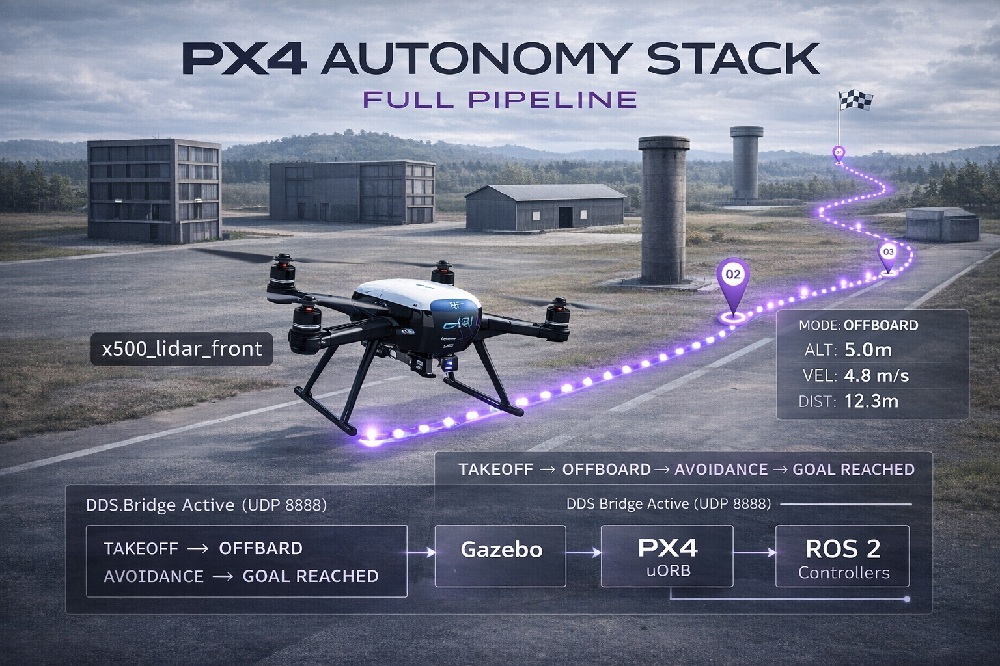

# PX4 Autonomous Missions — Gazebo Harmonic + ROS 2 + MAVSDK



Autonomous UAV control stack using **PX4 v1.15+**, **Gazebo Harmonic**, **ROS 2 Humble**, **px4_msgs + Micro XRCE-DDS**, and **MAVSDK-Python**. Includes a custom obstacle world, reactive AABB obstacle avoidance with climb/sidestep, failsafes, CSV telemetry, a one-shot full-stack launch, and QGroundControl integration.

---

## Stack

| Component | Version |
|-----------|---------|
| PX4 Autopilot (SITL) | v1.15+ |
| Gazebo Harmonic | gz-sim 8.x |
| ROS 2 | Humble |
| px4_msgs + Micro XRCE-DDS | native PX4 bridge |
| MAVROS2 | ros-humble-mavros (optional GCS relay) |
| MAVSDK-Python | 2.0+ |
| QGroundControl | Daily / Stable |
| Ubuntu | 22.04 |

---

## Architecture

```
full_stack.launch.py
  ├── PX4 SITL + Gazebo (obstacle_world)
  ├── MicroXRCEAgent :8888
  └── offboard_mission (ROS 2)
        px4_msgs + XRCE-DDS
              │
              └──── UDP :14540 ──── PX4 SITL
                                       │
                                  UDP :14550 → QGroundControl

MAVSDK scripts (mission.py / offboard_avoidance.py)
  Python → gRPC :50051 → mavsdk_server → MAVLink → PX4
```

---

## What's Included

### ROS 2 Package — `src/px4_offboard/`

| Node / Launch | Command | Description |
|---------------|---------|-------------|
| `full_stack` | `ros2 launch px4_offboard full_stack.launch.py` | One-shot: PX4 + XRCE + mission |
| `offboard_mission` | `ros2 run px4_offboard offboard_mission` | State machine + AABB avoidance + failsafes + mission executive + CSV log |
| `offboard_control` | `ros2 run px4_offboard offboard_control` | Minimal hover — baseline sanity check |
| `demo_hud` | (via full_stack / run_demo) | Presentation console: phase, avoidance, resources |
| `vv_replay` | `ros2 run px4_offboard vv_replay -- <csv>` | Offline V&V: requirement checks on flight logs |

### MAVSDK Scripts

| File | Description |
|------|-------------|
| `mission.py` | Lawnmower grid scan — 3×3 GPS waypoint mission, CSV telemetry |
| `obstacle_avoidance.py` | Pre-planned 8-waypoint path around all 5 obstacles |
| `offboard_avoidance.py` | Reactive OFFBOARD loop — geometry detection, NED control |
| `fly.py` | Minimal takeoff / 10 s hover / land test |
| `plot_flight.py` | Post-flight plot (GPS or mission NED logs) |

### Simulation & Config

| File | Description |
|------|-------------|
| `worlds/obstacle_world.sdf` | Gazebo Harmonic world — 5 color-coded static obstacles |
| `launch/simulation.launch.py` | PX4 SITL + Gazebo (+ optional MAVROS2) |
| `config/offboard_mission.yaml` | Mission / avoidance / failsafe parameters |
| `config/mavros_params.yaml` | MAVROS2 FCU URL, plugin allowlist, TF |
| `scripts/run_full_stack.sh` | Build-if-needed + launch helper |

---

## Recruiter Demo Mode

Launch the visible Gazebo mission with a concise presentation feed:

```bash
./scripts/run_demo.sh
```

The demo starts PX4 SITL, Gazebo, Micro XRCE-DDS, the autonomous mission,
the in-world flight trail, and a readable console HUD. The HUD highlights
mission-phase transitions, obstacle-avoidance events, position, altitude,
waypoint progress, and geofence health. Both the demo and normal
`full_stack.launch.py` launches default to `avoidance_strategy:=climb`
(vertical clearance). `avoidance_strategy:=sidestep` (lateral bypass) is
available as an opt-in / beta strategy — it only reasons about the nearest
obstacle, so in dense clusters it can route around one obstacle and into
another; use it with caution outside sparse obstacle layouts.

After the vehicle lands, press **Ctrl+C**. The runner closes the stack and
automatically saves a recruiter-ready flight report under `demo_artifacts/`.
The source telemetry CSV remains in the repository root.

Available mission variants:

```bash
./scripts/run_demo.sh waypoints  # reactive avoidance (best live demo)
./scripts/run_demo.sh course     # pre-planned clearance route
./scripts/run_demo.sh circle     # orbit demonstration
```

For a recorded portfolio clip, capture Gazebo and QGroundControl side by side
while this command runs. Keep the video to 60–90 seconds and finish on the
generated flight report.

---

## Obstacle World Layout

Five static obstacles in `worlds/obstacle_world.sdf` (GPS origin `47.397742°N, 8.545594°E`):

The training area includes a 30×60 m high-contrast course surface, 5 m reference
grid, marked launch pad, illuminated perimeter beacons, obstacle roof markers,
and visual landmarks outside the flight corridor. Decorative scenery is
visual-only and does not introduce collision geometry that is missing from the
avoidance map.

```
N (north)
^
50 |                          ★ WP8 destination
46 |              ● WP7
38 |                  [OB5 purple wall  0m east]
36 |                   ● WP6 (east of OB5)
32 |              ● WP5
24 | [OB3 green]      ● WP4      [OB4 blue]
15 |    ● WP2    ● WP3
10 |   [OB1 red -6m east]       [OB2 orange 10m east]
 5 |    ● WP1
 0 |  ★ SPAWN
   +---------------------------------------------> E (east)
       -10        0        10          meters
```

| Name | Position (E, N) | Size | Height |
|------|-----------------|------|--------|
| OB1 | (-6m, 10m) | 3×3m | 4m |
| OB2 | (10m, 10m) | 3×3m | 6m |
| OB3 | (-8m, 24m) | 4×3m | 4m |
| OB4 | (6m, 24m) | 2×2m | 5m |
| OB5 | (0m, 38m) | 5×3m | 4m |

---

## State Machine — `offboard_mission`

```
PREFLIGHT → ARMING → TAKEOFF → HOVER → MOVE → LANDING
                                 ↘ FAILSAFE (land) ↗
```

| Transition | Condition |
|-----------|-----------|
| PREFLIGHT → ARMING | 2 s setpoint pre-stream complete |
| ARMING → TAKEOFF | `nav_state=14` AND `arming_state=2` |
| TAKEOFF → HOVER | `\|z_err\|` < takeoff tolerance |
| HOVER → MOVE | hover hold complete |
| MOVE → LANDING | All waypoints reached (or circle orbits done) |
| * → FAILSAFE | Position timeout, mission timeout, or stuck in avoidance |

In **MOVE**, every setpoint passes through:

```
trajectory_generator()
    → _detect_obstacle()   # sensor topic override OR AABB vs SDF map
    → _apply_avoidance()   # climb-over if possible, else sidestep + smooth
    → publish_setpoint()
```

### Trajectory modes

```bash
# Reactive path through the obstacle field (default) — avoidance engages
ros2 launch px4_offboard full_stack.launch.py trajectory_mode:=waypoints

# Pre-planned clearance path (matches MAVSDK obstacle_avoidance.py)
ros2 launch px4_offboard full_stack.launch.py trajectory_mode:=course hover_alt_m:=8.0

# Orbit then land after max_orbits
ros2 launch px4_offboard full_stack.launch.py trajectory_mode:=circle
```

Or edit `config/offboard_mission.yaml` / pass `--params-file`.

### Sensor hook / live LiDAR

Default full-stack launch uses **`gz_x500_lidar_2d`** plus `lidar_sectors`, which reads the Gazebo GPU LiDAR and publishes:

```bash
/px4_offboard/obstacle_dir      # front | left | right | none
/px4_offboard/scan              # sensor_msgs/LaserScan (RViz)
/px4_offboard/lidar_sector_mins # [front, left, right] metres
```

`offboard_mission` prefers live LiDAR when fresh; AABB map geometry is only a fallback.

```bash
ros2 launch px4_offboard full_stack.launch.py use_lidar:=true vehicle:=gz_x500_lidar_2d
ros2 topic echo /px4_offboard/obstacle_dir
```

### Geo-cage & geofence

| Feature | Behavior |
|---------|----------|
| **Geo-cage** (soft) | Clamps setpoints inside a NED box (inset by `geocage_margin_m`) |
| **Geofence** (hard) | If position leaves the box → FAILSAFE (`land` / `hold` / `rtl`) |

Defaults cover the obstacle world: N∈[-5, 55], E∈[-23, 17], alt ≤ 12 m. Both start **enabled**.

```bash
# Runtime toggles
ros2 topic pub --once /px4_offboard/geocage_enable std_msgs/msg/Bool "{data: false}"
ros2 topic pub --once /px4_offboard/geofence_enable std_msgs/msg/Bool "{data: true}"

# Live status
ros2 topic echo /px4_offboard/fence_status
```

Optional: set `px4_fence_cmd: true` to also send PX4 `VEHICLE_CMD_DO_FENCE_ENABLE` (requires an onboard fence uploaded in QGC/params).

### Flight trail (Gazebo path visualization)

`flight_trail` drops cyan spheres along the path in Gazebo (orange while avoiding). Also publishes ROS Path/Marker for RViz.

```bash
ros2 run px4_offboard flight_trail
# clear trail
ros2 topic pub --once /px4_offboard/trail_clear std_msgs/msg/Bool "{data: true}"
# optional RViz
rviz2 -d $(ros2 pkg prefix px4_offboard)/share/px4_offboard/rviz/flight_trail.rviz
```

Included automatically in `full_stack.launch.py`.

### Failsafes

| Guard | Default | Action |
|-------|---------|--------|
| Position timeout | 1.5 s | FAILSAFE → land |
| Mission timeout | 180 s | FAILSAFE → land |
| Stuck in avoidance | 12 s without WP progress | FAILSAFE → land |
| Geofence breach | when enabled | FAILSAFE → `geofence_action` |

### Mission executive + resource manager

Spacecraft-style onboard executive layered on the flight state machine. Pure logic lives in `mission_executive.py` (unit-tested); `offboard_mission` wires it into MOVE / failsafes.

| Mode | Trigger (defaults) | Action |
|------|--------------------|--------|
| `NOMINAL` | Resources healthy | Full waypoint set |
| `DEGRADED` | Battery ≤45%, link ≤55%, propellant ≤90 s, or high compute | Skip `science_waypoints` (default 2,4,6) |
| `SAFE` | Battery ≤25%, link ≤30%, propellant ≤45 s | Hold position (stop advancing) |
| `ABORT` | Battery ≤12%, link ≤10%, propellant ≤20 s, or link lost ≥8 s | FAILSAFE → land |

Simulated resources: battery fraction, link quality (tied to position freshness), compute load, propellant time budget. Drain rates rise while moving / avoiding / using LiDAR.

```bash
ros2 topic echo /px4_offboard/executive_status
ros2 topic echo /px4_offboard/mission_status   # includes executive_mode + battery/link/prop
```

Tune via `config/offboard_mission.yaml` (`executive_enable`, thresholds, `science_waypoints`).

### Flight-log replay + V&V

Offline verification maps named requirements to checks against `flight_log_mission_*.csv` (no Gazebo required). Logs now include FAILSAFE/LANDING rows plus executive resource columns for evidence.

| ID | Requirement |
|----|-------------|
| `REQ-STATE-01` | Legal mission state transitions |
| `REQ-WP-01` | Waypoint index never decreases |
| `REQ-GEOCAGE-01` | Caged setpoints stay inside the fence |
| `REQ-GEOFENCE-01` | Airborne breach → FAILSAFE (or recovery) within 1.5 s |
| `REQ-ALT-01` | Altitude keep-in while geofence enabled |
| `REQ-TERM-01` | No return to MOVE after LANDING/FAILSAFE |
| `REQ-EXEC-01` | Executive ABORT followed by terminal state (SHOULD) |

```bash
# After a sim flight:
ros2 run px4_offboard vv_replay -- flight_log_mission_YYYYMMDD_HHMMSS.csv

# Or without sourcing install:
PYTHONPATH=src/px4_offboard:$PYTHONPATH \
  python3 -m px4_offboard.vv_replay flight_log_mission_....csv
```

Exit code `0` = all MUST requirements passed; `1` = fail (interview-friendly evidence trail).

---

## Installation

### 1 — PX4 + Gazebo Harmonic

```bash
git clone https://github.com/PX4/PX4-Autopilot.git --recursive ~/PX4-Autopilot
cd ~/PX4-Autopilot
bash Tools/setup/ubuntu.sh

# Optional: copy world into PX4 tree (launch also sets GZ_SIM_RESOURCE_PATH)
cp worlds/obstacle_world.sdf ~/PX4-Autopilot/Tools/simulation/gz/worlds/
```

### 2 — Micro XRCE-DDS Agent

```bash
git clone https://github.com/eProsima/Micro-XRCE-DDS-Agent.git
cd Micro-XRCE-DDS-Agent && mkdir build && cd build
cmake .. && make -j$(nproc)
sudo make install
```

### 3 — ROS 2 workspace

`px4_msgs` and `px4_ros_com` are PX4's own message/bridge packages and aren't
vendored in this repo — clone them into `src/` before building, matching
whatever PX4 firmware version you're running (v1.15+ here):

```bash
sudo apt install ros-humble-desktop python3-colcon-common-extensions

cd ~/Desktop/px4-autonomous-mission
git clone https://github.com/PX4/px4_msgs.git src/px4_msgs
git clone https://github.com/PX4/px4_ros_com.git src/px4_ros_com

source /opt/ros/humble/setup.bash
colcon build --symlink-install
source install/setup.bash
```

### 4 — MAVROS2 (optional)

```bash
sudo apt install ros-humble-mavros ros-humble-mavros-extras
wget https://raw.githubusercontent.com/mavlink/mavros/master/mavros/scripts/install_geographiclib_datasets.sh
sudo bash install_geographiclib_datasets.sh
```

### 5 — Python dependencies (MAVSDK scripts)

```bash
pip install -r requirements.txt
# Install mavsdk_server from: https://github.com/mavlink/MAVSDK/releases
```

### 6 — QGroundControl

Download from [qgroundcontrol.com](https://qgroundcontrol.com/). Auto-connects via UDP 14550.

---

## Running

### One-shot full autonomy (recommended)

```bash
./scripts/run_full_stack.sh              # waypoints (reactive)
./scripts/run_full_stack.sh course       # pre-planned clearance
./scripts/run_full_stack.sh waypoints headless
```

Or:

```bash
source /opt/ros/humble/setup.bash
source install/setup.bash
ros2 launch px4_offboard full_stack.launch.py
```

### Manual three-terminal flow

```bash
# Terminal 1 — PX4 SITL + Gazebo Harmonic
cd ~/PX4-Autopilot && rm -f build/px4_sitl_default/dataman
GZ_SIM_RESOURCE_PATH=~/Desktop/px4-autonomous-mission/worlds \
PX4_GZ_WORLD=obstacle_world make px4_sitl gz_x500

# Terminal 2 — Micro XRCE-DDS agent
MicroXRCEAgent udp4 -p 8888

# Terminal 3 — autonomy node
source /opt/ros/humble/setup.bash
source ~/Desktop/px4-autonomous-mission/install/setup.bash
ros2 run px4_offboard offboard_mission --ros-args \
  --params-file ~/Desktop/px4-autonomous-mission/config/offboard_mission.yaml
```

### MAVSDK missions

```bash
# Start MAVSDK server (install from MAVSDK releases — not bundled)
mavsdk_server udpin://0.0.0.0:14540

python3 mission.py
python3 obstacle_avoidance.py
python3 offboard_avoidance.py
python3 fly.py
```

### Simulation only (PX4 + Gazebo + MAVROS2)

```bash
ros2 launch launch/simulation.launch.py
ros2 launch launch/simulation.launch.py headless:=true
```

---

## Monitor

```bash
listener vehicle_status
ros2 topic echo /fmu/out/vehicle_local_position
ros2 topic echo /px4_offboard/obstacle_dir
```

---

## Port Reference

| Port | Protocol | Purpose |
|------|----------|---------|
| 8888 | UDP | Micro XRCE-DDS agent |
| 14540 | UDP | MAVLink offboard (MAVSDK / MAVROS) |
| 14550 | UDP | GCS — QGroundControl |
| 50051 | TCP | MAVSDK gRPC server |

---

## Telemetry & Visualization

MAVSDK scripts and `offboard_mission` write timestamped CSV logs (`flight_log_*.csv` / `flight_log_mission_*.csv`).

```bash
python3 plot_flight.py   # → flight_plot.png (auto-detects GPS vs NED schema)
```

Mission logs include state, NED position, setpoint, obstacle flag, and waypoint index.

---

## Real Hardware

1. Point PX4 XRCE agent at the vehicle Ethernet/Serial bridge (or use MAVROS `fcu_url`).
2. Publish real sectors on `/px4_offboard/obstacle_dir` (or replace `_detect_obstacle()`).
3. Tune `config/offboard_mission.yaml` altitudes and timeouts for the airframe.

```yaml
# config/mavros_params.yaml (if using MAVROS)
fcu_url: "serial:///dev/ttyTHS1:921600"   # UART (Jetson / RPi)
fcu_url: "serial:///dev/ttyUSB0:57600"    # USB serial
```

---

## Notes

- Run `rm -f ~/PX4-Autopilot/build/px4_sitl_default/dataman` before each SITL restart (full_stack launch does this)
- Simulated battery drains — full sim restart required between flights
- World SDF contains no plugin declarations — sensor plugins come from PX4's `server.config`
- Do not rename sensor names in `x500_base/model.sdf` — they match `GZBridge.cpp` topic paths

---

## Author

Abel — UAV autonomy stack development
GitHub: github.com/abelxmendoza
