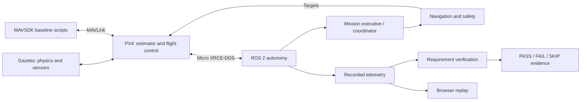

# PX4 / ROS 2 Autonomy & Verification Platform

A software-in-the-loop autonomous UAV platform built with ROS 2, PX4, Gazebo, MAVSDK, and MAVLink for developing, fault-testing, replaying, and verifying autonomous flight behavior.

**Built by Abel Mendoza.** PX4 stabilizes and controls the simulated aircraft. Abel implemented the ROS 2 mission logic, navigation and safety integration, sensor bridges, cooperative coordinator, telemetry pipeline, replay, and requirement-based verification around it. The purpose is to make autonomous behavior observable and testable when something fails.


```mermaid
flowchart LR
    G[Gazebo: physics and sensors] <--> P[PX4: estimator and flight control]
    P <-->|Micro XRCE-DDS| R[ROS 2 autonomy]
    M[MAVSDK baseline scripts] <-->|MAVLink| P
    R --> E[Mission executive / coordinator]
    E --> N[Navigation and safety]
    N -->|Targets| P
    R --> T[Recorded telemetry]
    T --> V[Requirement verification]
    V --> F[PASS / FAIL / SKIP evidence]
    T --> B[Browser replay]
```

**See it in 32–64 seconds:** [browser replay](https://replay-sepia-tau.vercel.app/demo/) · [local replay source](web/replay/demo/index.html) · [golden demo and reproduction](docs/golden_demo.md). The hosted URL is an existing deployment; changes in this checkout require publishing before they appear there. The new flagship is the 64-second **Fault, Recovery, Verification** recording; choose 2× playback for a 32-second overview. No PX4/Gazebo installation is needed to inspect the checked-in reports or serve the replay.

**The engineering story:** a commanded fault lands one vehicle → fresh landing/disarm evidence gates reassignment → the surviving vehicle completes four point visits → both land → an independent verifier checks the recorded evidence. This focused scenario uses known-map routing, not LiDAR or camera navigation.

| Measured engineering result | Evidence |
| --- | --- |
| Fresh recovery flight: **641 samples**, **2 reassignments**, **8.095491 m** minimum horizontal separation against a **2.5 m** requirement | [Report](evidence/swarm/golden_report.json) · [raw log](evidence/swarm/golden_recovery.jsonl.gz) |
| **21 catalog requirements**, mapped to 14 existing single-vehicle checks and cooperative acceptance behavior | [Requirements](docs/requirements.md) · [verification matrix](docs/verification_matrix.md) |
| **7 curated cases**: 5 SITL recordings and 2 kinematic before/after traces; all expected outcomes reproduced, including an intentional failure | [Evidence manifest](evidence/manifest.json) |
| **166 Python tests** with ROS enabled; **24 browser tests** | [Commands, results and scope](docs/engineering_results.md) |
| **2 documented defects**: premature task completion and dropped terminal replay evidence | [Coordinator case study](docs/case_studies/swarm-endpoint-acceptance.md) · [replay boundary case](docs/case_studies/replay-terminal-sample.md) |

**Why verification matters:** two recovery tests reported COMPLETE while the drone had only passed within about 0.8–0.9 m of task points. Position-based verification rejected them. The coordinator now requires a closer endpoint visit; the original tests pass unchanged, and the preserved faulty recording must still fail.

**Scope and limits:** fixed two-vehicle, single-host SITL; no hardware or HIL validation. GPS-loss work is **PX4 estimator integration using simulated external odometry under GPS-aiding loss**: Gazebo pose plus modeled noise/drift, not visual SLAM or camera localization. ArUco detection is perception infrastructure and does not control the primary mission. A PASS applies only to documented checks; skipped checks, incomplete single-vehicle logs and unexercised faults are not proof of full mission success. Sampled separation does not prove continuous collision freedom or landing-pad accuracy.

## Inspect or reproduce

Offline evidence verification uses Python's standard library:

```bash
python3 scripts/verify_evidence.py
```

Run logic and verification tests (ROS-dependent modules explicitly skip without ROS):

```bash
PYTHONPATH=src/px4_offboard python3 -m pytest src/px4_offboard/test -q
```

Serve the browser replay locally, then open `http://localhost:8000/demo/`:

```bash
python3 -m http.server 8000 --directory web/replay
```

Re-run the flagship on the configured Linux simulation workstation:

```bash
source /opt/ros/humble/setup.bash
source install/setup.bash
python3 scripts/run_swarm_demo.py --dropout
```

## Existing capabilities and ownership

The single-vehicle stack includes a mission state machine, LiDAR reactive avoidance, A* known-map planning, geofence response, resource-aware mission degradation, telemetry, and GPS-aiding-loss estimator integration. The separate cooperative stack coordinates gate/landing-point visits with route reservations, local watchdogs and landing-confirmed reassignment. MAVSDK scripts provide simpler takeoff, grid-scan and avoidance baselines.

PX4, ROS 2, Gazebo, Micro XRCE-DDS, MAVSDK, MAVLink, OpenCV and Three.js are upstream components. This repository's contribution is their autonomy, fault-handling, observation and verification integration. It demonstrates robotics/flight software, systems integration, simulation, and test & validation work; it does not claim to implement PX4's flight-control algorithms.

- [System setup, commands and single-vehicle reference](docs/operations.md)
- [Current cooperative scenario and limits](docs/multi_vehicle.md)
- [Engineering results](docs/engineering_results.md)
- [Curated evidence and provenance](evidence/README.md)
- [Repository hygiene audit](docs/repository_hygiene.md)
- [macOS development without the simulator](DEV_MACOS.md)
