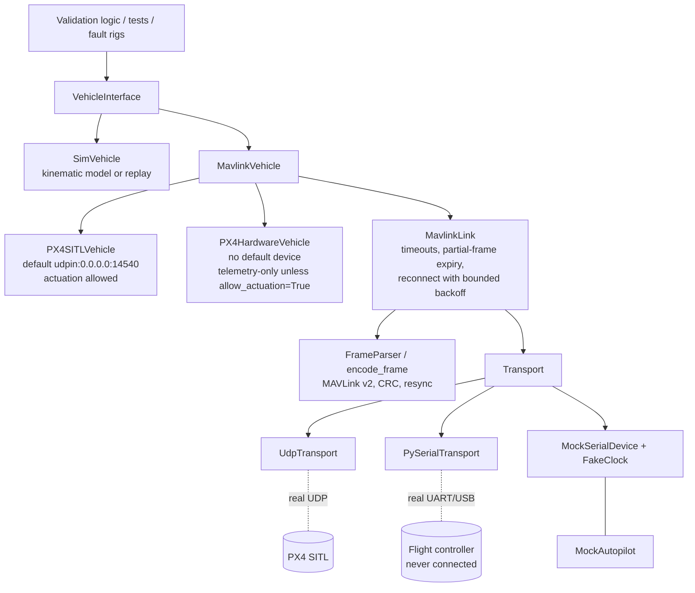

# Hardware-in-the-loop architecture

Goal: validation logic is written once against `VehicleInterface` and runs unchanged against a
simulation/replay stand-in, PX4 SITL, or a real PX4 flight controller on a UART/USB link. Nothing in a test
may branch on which one it has.

**Status, stated plainly:** the simulation and SITL paths have been executed (SITL: one recorded session
against PX4 `v1.16.0-5-gd26cb57aca`). The hardware path is implemented and tested **only against a mock
autopilot**. No physical flight controller has been connected, so there is no hardware-in-the-loop *result* in
this repository -- only the architecture that would produce one.



## Interfaces

| Piece | File | Role |
| --- | --- | --- |
| `VehicleInterface`, `VehicleState`, `LinkHealth`, errors | `vehicle/interface.py` | The contract: `connect`, `disconnect`, `update`, `state`, `arm`, `disarm`, `set_velocity`, `link_health`. Says nothing about SITL, serial or simulators. |
| `SimVehicle` | `vehicle/sim.py` | First-order velocity-tracking point mass, or replay of recorded states. A test double, not a flight-dynamics model. |
| `MavlinkVehicle` | `vehicle/mavlink_vehicle.py` | All protocol handling: heartbeat/attitude/local-position decode, `COMMAND_LONG` arm/disarm with ack and timeout, velocity setpoints, link health. |
| `PX4SITLVehicle` | same | `kind = SITL`, default `udpin:0.0.0.0:14540` (PX4's onboard MAVLink port), actuation allowed. |
| `PX4HardwareVehicle` | same | `kind = HARDWARE`, **no default device**, **actuation off by default**. |
| Connection strings | `vehicle/connection.py` | `udpin:HOST:PORT`, `udp:HOST:PORT`, `serial:DEVICE[:BAUD]` (e.g. `serial:/dev/ttyACM0:921600`); validated, round-trippable. |
| `Transport`, `SerialConfig` | `comms/serial_transport.py` | `open/close/read(timeout)/write`; `PySerialTransport` (real UART, configurable device/baud/parity/stop bits), `MockSerialDevice` (deterministic). |
| `UdpTransport` | `comms/udp_transport.py` | Listen (`udpin`, learns the peer from the first datagram) or send (`udp`). |
| `MavlinkLink` | `comms/link.py` | Supervision: read timeouts, partial-frame expiry, link-liveness from *valid frames only*, reconnect with exponential backoff and a hard attempt limit, recorded reconnect time. |
| MAVLink v2 codec | `comms/mavlink_frame.py`, `comms/messages.py` | Encode/parse; byte-identical to pymavlink for the messages used. |
| I2C / SPI stubs | `comms/buses.py` | Interfaces + mock buses for NACK/retry/hang and register conventions. Logic only. |

Configurable MAVLink connections: construct a vehicle with a connection string, or inject any `Transport`:

```python
from px4_offboard.vehicle.mavlink_vehicle import PX4SITLVehicle, PX4HardwareVehicle

sitl = PX4SITLVehicle("udpin:0.0.0.0:14540")                                      # SITL
bench = PX4HardwareVehicle("serial:/dev/ttyACM0:921600")                          # telemetry-only
bench = PX4HardwareVehicle("serial:/dev/ttyACM0:921600", allow_actuation=True)    # deliberate opt-in
```

## Safety design for hardware

- `PX4HardwareVehicle` refuses `arm`, `disarm` and `set_velocity` (raises `ActuationNotPermitted`, nothing is
  written to the wire) unless `allow_actuation=True` is passed explicitly. REQ-HIL-002 tests the wire.
- It has no default serial device: the caller must name the port.
- The first hardware bring-up should be telemetry-only, props off.

## One contract, three implementations

`test_vehicle_conformance.py` parametrises the same tests over `SimVehicle`, `PX4SITLVehicle` and
`PX4HardwareVehicle`: telemetry after connect, arm/disarm, velocity command moves the vehicle north,
disconnect. SITL and hardware classes run against `MockAutopilot` (a heartbeat/attitude/position source that
accepts arm and velocity setpoints) over a mock transport. This shows the host-side code is
target-independent. It does not show that PX4 behaves like the mock.

## What was actually run

| Claim | How it was established | Where |
| --- | --- | --- |
| Codec matches the reference | Byte-for-byte against pymavlink, plus 12 shared golden vectors checked by the C++ codec | REQ-COMMS-001, `make cpp-test` |
| Parser survives noise, bad CRC, truncation | Unit tests, deterministic mock serial | REQ-COMMS-002 |
| Reconnect behaviour | Unit tests on a fake clock; fault scenario `link_faults` | REQ-COMMS-003, REQ-RECOVERY-002 |
| Real UART driver path | `PySerialTransport` round-trip over an OS pseudo-terminal (no hardware) | `test_comms_transport.py` |
| **Interop with real PX4 firmware** | `tools/sitl_smoke.py` against PX4 SITL (headless `gz_x500`): telemetry decoded (27 frames, 0 bad CRCs; 41 other-message frames skipped as unknown), arm and disarm accepted | REQ-HIL-003, `evidence/hil/sitl_smoke.json` |
| Real flight controller over UART/USB | **Not done** | REQ-HIL-004 `NOT_RUN` |
| Physical I2C/SPI | **Not done** (mock buses only) | REQ-COMMS-006 `PARTIAL` |

Defects this work found by running against something real or adversarial (all fixed, all with tests):

- a one-chunk-per-poll reader fell behind a 40 frame/s stream without bound (found by the conformance suite);
- PX4 denies arm without a GCS heartbeat, so a companion link must send one (`send_heartbeat`), found live;
- sending on a listening UDP link before the first datagram was treated as a lost link (found live); it is now
  `LinkNotReady` and leaves the link up.

## Bringing up real hardware (not yet done)

1. Connect the flight controller by USB/telemetry UART, props off. Confirm the device name and baud.
2. `PX4HardwareVehicle("serial:<dev>:<baud>")`, telemetry-only. Expect heartbeat and attitude; check
   `link_health()` and the parser's `bad_crc`/`unknown_msg` counters.
3. Write `artifacts/hardware/uart_telemetry.json` as `{"passed": true, "detail": "..."}` from a script that
   did the above; REQ-HIL-004 then evaluates it (and the registry reports it as recorded evidence, so keep the
   provenance in `detail`).
4. Only then consider `allow_actuation=True`, still props off, and only for arm/disarm acknowledgement.

## Known limits

- `MockAutopilot` has no EKF, modes or failsafes; it cannot reveal PX4 behaviour.
- MAVLink v2 only; signed frames are reported unsupported, not verified. Only the message ids in
  `CRC_EXTRA` are decoded (others are counted and dropped).
- No flow-control or physical-layer fault modelling for serial (framing/parity errors, RTS/CTS).
- `MavlinkVehicle.set_velocity` sends the setpoint; entering OFFBOARD mode and the required setpoint stream
  rate are the caller's responsibility and were not exercised against SITL in this work.
